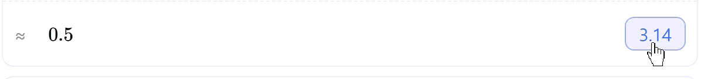
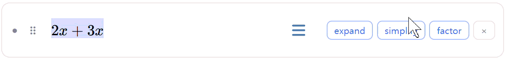
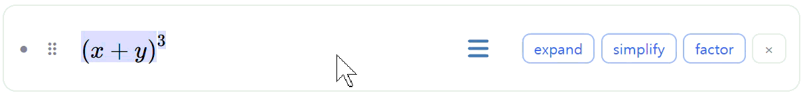

## sikddalkak
A symbolic calculator notebook. Write formulas, stack them as cells, and let
named variables flow between them.

https://silgray.github.io/sikddalkak/

## Main feature

1. **Write an expression** — type any mathematical expression.
2. **Press Enter to evaluate** — hit Enter to evaluate it instantly.
3. **See the result** — the result appears immediately.

### Evaluation
Evaluation has two modes.
- **formula** — the exact mathematical value.
- **decimal** — a numeric approximation.

  

Define symbols. Write `a = 3` or `f(x) = x^2` in a cell and any other cell can use it.
Evaluating substitutes those symbols recursively first and computes the
whole thing in one pass. Cyclic definitions are reported.

The result row is editable. The first time you change it, it becomes a new cell
of its own right below — so you can keep working from a result without losing
the step that produced it.

### Manipulating Expressions

1. Select part of an expression. 
2. Transform it.
    - **Simplify** — reduce an expression to its simplest equivalent form.
    - **Expand** — expand products and powers into a sum of terms.
    - **Factor** — factor an expression into a product of simpler terms.

Every manipulation considers the order of non-commutative products.
Matrix multiplication $ABA$ never collapses into $A^2B$.

#### Simplify

Combines like terms and cancels what it can, without expanding what you wrote.

$$\frac{x^2-1}{x+1} \to x-1 \qquad AA^{-1} \to I \qquad AAAA \to A^4$$

  

#### Expand

Distributes products over sums, then combines like terms.

$$(x+1)^2 \to x^2+2x+1 \qquad (A+B)^2 \to A^2 + AB + BA + B^2$$

  

#### Factor

Pulls out common factors and factors polynomials. Where a product is
non-commutative, only the front and back of each term are pulled out.

$$x^2-1 \to (x+1)(x-1) \qquad AB+AC \to A(B+C)$$

  

## Supported notations

### Arithmetic

| Notation | Meaning |
|---|---|
| $+$, $-$ | addition, subtraction |
| $\cdot$, $\times$ | multiplication |
| $\frac{b}{a}$ | fraction |
| $x^n$ | power |

### Functions

| Notation | Meaning |
|---|---|
| $\sin,~ \cos,~ \tan$ | trigonometric |
| $\sin^{-1},~ \cos^{-1},~ \tan^{-1},~ \arcsin,~ \arccos,~ \arctan$ | inverse trigonometric |
| $\sinh,~ \cosh,~ \tanh$ | hyperbolic |
|  $\exp,~ \ln,~ \log$ | exponential and logarithmic |

### Vector

| Notation | Meaning |
| --- | --- |
| $v \cdot w$ | dot product |
| $v \times w$ | cross product |

A vector is a column vector by default — write $v^T$ for a row vector.

### Matrix

| Notation | Meaning |
|---|---|
| $\det(A)$ | determinant |
| $\mathrm{tr}(A)$ | trace |
| $A^T$, $A^t$ | transpose |
| $A^*$ | complex conjugate, entry by entry |
| $A^\dagger$ | conjugate transpose |
| $A^{-1}$ | inverse |
| $I$ | identity matrix |

### Complex numbers

| Notation | Meaning |
|---|---|
| $\mathrm{Re}(z),~ \mathrm{Im}(z)$ | real / imaginary part |
| $\overline{z}$ | complex conjugate |

### Calculus

| Notation | Meaning |
|---|---|
| $\displaystyle \frac{df}{dx}, \frac{d}{dx}f, f'(x), f''(x)$ | derivative, including higher orders |
| $\displaystyle \frac{d}{d(x,y,z)}$ | multivariable derivative |
| $\displaystyle \frac{d^3}{dx^3}, \left(\frac{d}{dx}\right)^3$ | higher-order derivative |
| $\displaystyle \int_{a}^{b} f(x) \, dx$ | definite or indefinite integral |
| $\displaystyle \sum_{n=1}^{10}a_n,\quad \prod_{n=1}^{10}a_n$ | sum / product |

## Keyboard shortcuts

### Edit

| Shortcut | Action |
|---|---|
| `Enter` | Evaluate current expression |
| `Ctrl`+`Enter` / `Ctrl`+`Shift`+`Enter` | Insert a new empty cell below / above |
| `Alt`+`↑`/`↓` | Move the cell up / down |
| `Shift`+`Alt`+`↑`/`↓` | Duplicate the cell below / above |
| `Ctrl`+`D` | Grow selection |
| `Ctrl`+`Shift`+`E`/`S`/`F` | Apply expand / simplify / factor to the selection |

### Input

#### Structures

| Type | Result |
|---|---|
| `sqrt`, `cbrt`, `nthroot` | $\sqrt{\square}$, $\sqrt[3]{\square}$, $\sqrt[\square]{\square}$ |
| `sum`, `prod` | $\displaystyle\sum_{\square}^{\square}$, $\displaystyle\prod_{\square}^{\square}$ |
| `int`, `defint` | $\displaystyle\int_{\square}^{\square}$ |

#### Operators and relations

| Type | Result |
|---|---|
| `xx`, `times` | $\times$ |
| `*` | $\cdot$ |
| `**` | $*$ (for $A^\ast$) |
| `tt` | $\dagger$ (for $A^\dagger$)|

#### Functions

| Type | Shortcut | Result |
|---|---|---|
| `sin`, `cos`, `tan`, `sec`, `csc`, `cot` |-| $\sin$, $\cos$, $\tan$, $\sec$, $\csc$, $\cot$ |
| `arcsin`, `arccos`, `arctan` |-| $\arcsin$, $\arccos$, $\arctan$ |
| `sinh`, `cosh`, `tanh`, `coth`, `sech` |-| $\sinh$, $\cosh$, $\tanh$, $\coth$, $\mathrm{sech}$ |
| `ln`, `log`, `lg`, `exp` |-| $\ln$, $\log_{\square}$, $\lg$, $\exp$ |
| `det`, `tr` |-| $\det$, $\mathrm{tr}$ |
| `Re`, `Im` |-| $\mathrm{Re}$, $\mathrm{Im}$ |
| `conj` | `Alt`+`-` | $\overline{z}$ |
<!-- | `max`, `min`, `argmax`, `argmin` |-| $\max$, $\min$, $\mathrm{arg\,max}$, $\mathrm{arg\,min}$ |
| `gcd`, `lcm`, `mod`, `(mod` |-| $\gcd$, $\mathrm{lcm}$, $\bmod$, $\pmod{\square}$ |
| `erf`, `erfc`, `bessel`, `mean`, `median` |-| $\mathrm{erf}$, $\mathrm{erfc}$, $\mathrm{bessel}$, $\mathrm{mean}$, $\mathrm{median}$ | -->

#### Greek letters and symbols

| Type | Shortcut | Result |
|---|---|---|
| `alpha` … `omega` |-| $\alpha$, $\beta$, $\gamma$, $\delta$, $\epsilon$, $\zeta$, $\eta$, $\theta$, $\iota$, $\kappa$, $\lambda$, $\mu$, $\nu$, $\xi$, $\pi$, $\rho$, $\sigma$, $\tau$, $\upsilon$, $\phi$, $\chi$, $\psi$, $\omega$ |
| `Delta`, `Gamma`, `Theta`, `Lambda`, `Xi`, `Pi`, `Sigma`, `Phi`, `Psi`, `Omega` |-| $\Delta$, $\Gamma$, $\Theta$, $\Lambda$, $\Xi$, $\Pi$, $\Sigma$, $\Phi$, $\Psi$, $\Omega$ |
| `varepsilon`, `vartheta`, `varphi` |-| $\varepsilon$, $\vartheta$, $\varphi$ |
| `nabla`, `grad` | `Alt`+`D` | $\nabla$ |
| `del` |-| $\partial$ |
| `infinity` |-| $\infty$ |
| `deg` (after a digit) |-| $^\circ$ |
